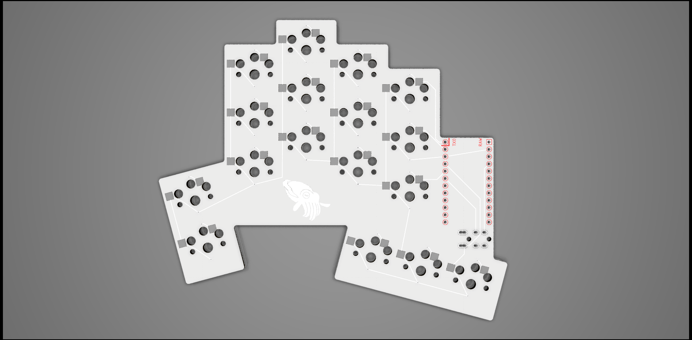
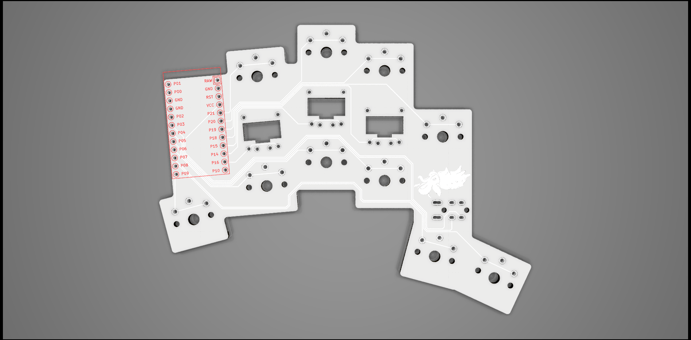
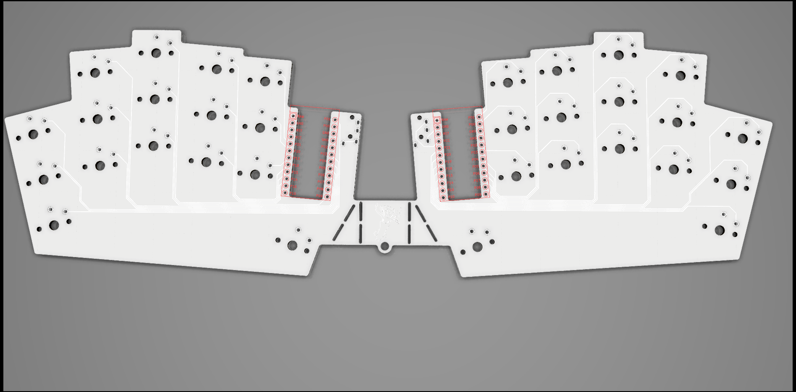
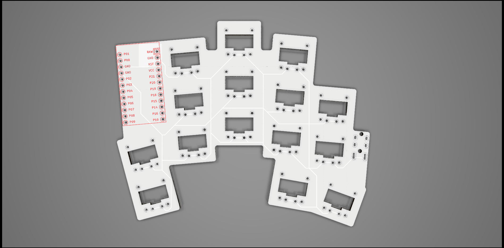
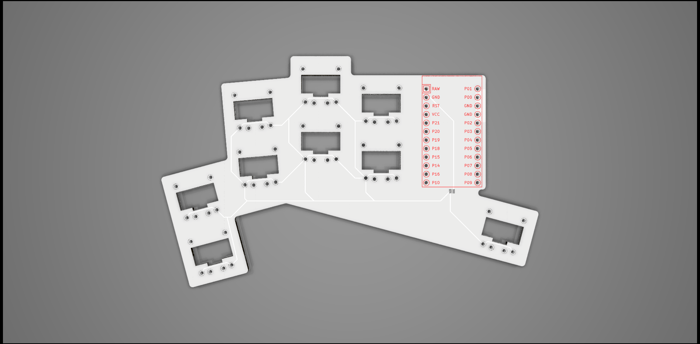

# Cephalopoda

A collection of low profile split ergonomic mechanical keyboards I have created using [ergogen](https://github.com/mrzealot/ergogen).

## Sepia officinalis

AKA S. officinalis, S.O., "Cuttlefish"

34 keys, aggresive pinky stagger with top row omitted.

## Metasepia pfefferi

AKA M. pfefferi, M.P., "Flamboyant cuttlefish"

26 keys, similar to the S. officinalis, but with top/bottom keys of pinky and inner columns omitted. 2 thumb keys.

## Dosidicus gigas

AKA D. gigas, D.G., "Jumbo squid"

32 keys, same pinky stagger as S. officinalis and M. pfefferi, but with all "alpha" keys included. Pinky, ring, index, and inner columns splayed at 15, 5, -5, -5 degrees from middle column.

## Todarodes pacificus

AKA T. pacificus, T.P., "Japanese flying squid"

30 keys, 15, 5, 0, -5, -5 degree splay. My take on the Hummingbird layout.

## Todarodes sagittatus

AKA T. sagittatus, T.S., "European flying squid"

Same stagger as the T. pacificus, but no splay.

## Idiosepius thailandicus

AKA I. thailandicus, I.T., "Pygmy bobtail squid"

Designed with the ARTSEY layout in mind, but could also be used with ASTENIOP.
BlueMicro compatible.

